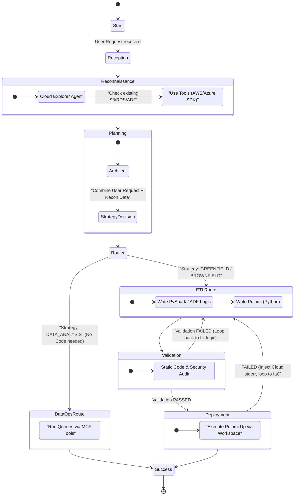

# 🌌 NexusFlow: Agentic Cross-Cloud Data Orchestrator

## Executive Summary
NexusFlow is an intelligent, agent-driven data engineering platform designed to automate the end-to-end lifecycle of ETL pipelines across heterogeneous cloud environments (AWS, Azure, Databricks). 

Unlike traditional code generators or CLI copilots, NexusFlow acts as an **Autonomous AI Data Engineer**. It utilizes a strict Directed Acyclic Graph (DAG) state machine to:
1. **Discover** existing cloud environments (Brownfield vs. Greenfield).
2. **Architect** optimal data pipelines.
3. **Write** high-performance PySpark/JSON ETL scripts and Pulumi Infrastructure-as-Code (IaC).
4. **Self-Correct** by catching parser errors or cloud deployment failures, looping back to rewrite code autonomously.

---

## 🧠 System Architecture: "The Brain and The Muscle"

NexusFlow separates orchestration logic from execution tools:
*   **The Brain (LangGraph):** A deterministic state machine that routes prompts and context between specialized AI Agents.
*   **The Eyes (Cloud SDKs):** Read-only tools (AWS Boto3, Azure ARM) used to scan existing cloud infrastructure.
*   **The Muscle (Pulumi & Terminal):** Safely executes shell commands, provisions cloud resources, and manages state.
*   **The Nervous System (Langfuse):** Complete OpenTelemetry observability, tracing every LLM thought, token cost, and tool call.

### Agentic Workflow (The State Machine)
The core orchestration is defined in `workflow.ts`. Below is the logical flow. Future LLMs should reference this Mermaid diagram to understand the routing logic:



---

## 🤖 The Agent Personas

Each node in the LangGraph invokes a specialized agent extending `BaseAgent.ts`:

1.  **Cloud Explorer (`explorerNode`)**: Equipped with read-only AWS/Azure SDK tools. Scans the user's cloud to see if requested buckets, DBs, or roles already exist.
2.  **Cloud Architect (`architectNode`)**: Analyzes the user request + Explorer's findings. Outputs a JSON plan and assigns an execution strategy (`GREENFIELD`, `BROWNFIELD_ETL`, or `DATA_ANALYSIS`).
3.  **ETL Coder (`etlCoderNode`)**: The heavy lifter. Writes high-performance PySpark, ADF JSON, or SQL. Instructed to properly escape all JSON string outputs to prevent parsing crashes.
4.  **IaC Coder (`iacCoderNode`)**: Writes Pulumi Python scripts. Uses context to know whether to provision new resources (`GREENFIELD`) or look up existing ones (`BROWNFIELD`).
5.  **Validator (`validatorNode`)**: The strict gatekeeper. Audits artifacts for hardcoded secrets, syntax errors, and missing dependencies.
6.  **Data Ops (`dataOpsNode`)**: Activated only for data queries. Connects to existing databases via MCP (Model Context Protocol).

---

## 🛠 Core Technologies & Libraries

*   **LLM Orchestration:** `@langchain/langgraph`, `@langchain/openai`, `@langchain/core`
*   **LLM Router:** OpenRouter (Supports routing to specific models per task, e.g., DeepSeek for Architect, Qwen/Claude for Coders).
*   **Infrastructure:** Pulumi (Python runtime). Chosen over Terraform because LLMs are substantially better at generating and debugging native Python than HCL.
*   **Cloud SDKs:** `@aws-sdk/client-*`, `@azure/arm-*`
*   **Observability:** `@langfuse/langchain`, `@langfuse/otel`, `@opentelemetry/sdk-node`
*   **Validation/Formatting:** `zod`, `js-yaml`, custom `ParserUtils.ts`

---

## 📂 Directory Structure

```text
NexusFlow/
├── backend/
│   ├── src/
│   │   ├── agents/            # LLM Prompts and Base classes
│   │   │   └── roles/         # Specific agent personas
│   │   ├── config/            # System configuration & HITL settings
│   │   ├── graph/             # LangGraph state machine definition
│   │   │   ├── nodes.ts       # Function handlers for each graph step
│   │   │   ├── state.ts       # Central memory annotation object
│   │   │   └── workflow.ts    # Edge routing and conditional loops
│   │   ├── mcp/               # Model Context Protocol external servers
│   │   ├── safety/            # Human-in-the-loop (HITL) and path blocklists
│   │   ├── services/          # External services (Pulumi execution)
│   │   ├── tools/             # Capabilities granted to LLMs
│   │   │   ├── cloud/         # AWS/Azure Read-Only SDK commands
│   │   │   ├── fs/            # Local file system edits
│   │   │   ├── terminal/      # Secure shell execution
│   │   │   └── toolRegistry.ts# Role-based tool access control
│   │   ├── tracing/           # Langfuse & OTEL setup
│   │   ├── utils/             # Helper classes (ParserUtils)
│   │   └── test-run.ts        # CLI Entry point for pipeline testing
│   ├── .env
│   └── package.json
└── frontend/                  # (Pending) React Flow UI Dashboard
```

---

## 🔄 The Self-Correction Loop (Note for LLMs)

**To Future LLM Assistants reading this codebase:** 
The most critical feature of this application is its *resiliency*. We do not want the app to crash if an LLM hallucinates bad JSON or if AWS rejects an IAM policy. 

1.  **Parsing Failures:** If `ParserUtils.extractOutput()` fails, the node catches the error, sets `state.validationErrors` to the exact error message, and routes back to the specific coder.
2.  **Deployment Failures:** If `PulumiService` returns a non-zero exit code (e.g., Cloud API rejection), the `DeployerNode` catches `stderr`, sets `state.validationErrors`, and the Graph routes *back to the IaC Coder* to fix the Python infrastructure script.

*Always ensure agents return perfectly escaped JSON arrays/objects, avoiding markdown backticks (` ``` `).*

---

## 🚀 Getting Started (Development)

### 1. Prerequisites
*   Node.js (v18+)
*   Pulumi CLI installed (`npm install -g pulumi`)
*   AWS CLI and Azure CLI installed and authenticated (if testing cloud deployments)

### 2. Environment Variables
Create a `.env` file in the `backend/` directory:

```env
# LLM Routing
OPENROUTER_API_KEY="sk-or-v1-..."
MODEL_NAME="openai/gpt-4o-mini" # Default fallback

# Tracing
LANGFUSE_PUBLIC_KEY="pk-lf-..."
LANGFUSE_SECRET_KEY="sk-lf-..."
LANGFUSE_BASE_URL="https://cloud.langfuse.com"

# Cloud Credentials
AWS_REGION="us-east-1"
AWS_ACCESS_KEY_ID="..."
AWS_SECRET_ACCESS_KEY="..."
AZURE_SUBSCRIPTION_ID="..."
```

### 3. Run the Engine
To test the pipeline orchestration via the CLI:
```bash
cd backend
npm install
npx tsx src/test-run.ts
```

### 4. Observe
Navigate to your Langfuse dashboard to view the exact hierarchical execution trace, tool payloads, and cost metrics for the run.

---

## 🔮 Next Steps & Roadmap
*   **Frontend UI:** Build an Express Web Socket server in the backend to stream `currentStep` state updates to a Next.js / React Flow frontend, rendering the active node dynamically.
*   **State Persistence:** Connect LangGraph to a Postgres database (via `checkpointer`) to allow resuming paused graphs.
*   **Auto-Cleanup:** Implement a `CLEANUP` node to autonomously run `pulumi destroy` for ephemeral testing workspaces.